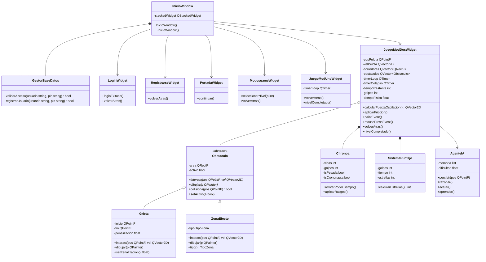

```mermaid
classDiagram
  direction TB

  class InicioWindow {
    -stackedWidget QStackedWidget
    +InicioWindow()
    +~InicioWindow()
  }

  class GestorBaseDatos {
    +validarAcceso(usuario string, pin string) bool
    +registrarUsuario(usuario string, pin string) bool
  }

  class LoginWidget {
    +loginExitoso()
    +volverAtras()
  }

  class RegistrarseWidget {
    +volverAtras()
  }

  class PortadaWidget {
    +continuar()
  }

  class ModosgameWidget {
    +seleccionarNivel(n int)
    +volverAtras()
  }

  class JuegoModUnoWidget {
    -timerLoop QTimer
    +volverAtras()
    +nivelCompletado()
  }

  class JuegoModDosWidget {
    -posPelota QPointF
    -velPelota QVector2D
    -corredores QVector~QRectF~
    -obstaculos QVector~Obstaculo~
    -timerLoop QTimer
    -timerColapso QTimer
    -tiempoRestante int
    -golpes int
    -tiempoFisica float
    +calcularFuerzaOscilacion() QVector2D
    +aplicarFriccion()
    +paintEvent()
    +mousePressEvent()
    +volverAtras()
    +nivelCompletado()
  }

  class Obstaculo {
    <<abstract>>
    -area QRectF
    -activo bool
    +interact(pos QPointF, vel QVector2D)*
    +dibujar(p QPainter)*
    +colisiona(pos QPointF) bool
    +setActivo(a bool)
  }

  class Grieta {
    -inicio QPointF
    -fin QPointF
    -penalizacion float
    +interact(pos QPointF, vel QVector2D)
    +dibujar(p QPainter)
    +setPenalizacion(v float)
  }

  class ZonaEfecto {
    -tipo TipoZona
    +interact(pos QPointF, vel QVector2D)
    +dibujar(p QPainter)
    +tipo() TipoZona
  }

  class Chronoa {
    -vidas int
    -golpes int
    -isPesada bool
    -isCrononauta bool
    +activarPoderTiempo()
    +aplicarRasgos()
  }

  class SistemaPuntaje {
    -golpes int
    -tiempo int
    -estrellas int
    +calcularEstrellas() int
  }

  class AgenteIA {
    -memoria list
    -dificultad float
    +percibir(pos QPointF)
    +razonar()
    +actuar()
    +aprender()
  }

  InicioWindow *-- GestorBaseDatos
  InicioWindow --> LoginWidget
  InicioWindow --> RegistrarseWidget
  InicioWindow --> PortadaWidget
  InicioWindow --> ModosgameWidget
  InicioWindow --> JuegoModUnoWidget
  InicioWindow --> JuegoModDosWidget
  JuegoModDosWidget *-- Chronoa
  JuegoModDosWidget *-- SistemaPuntaje
  JuegoModDosWidget --> AgenteIA
  JuegoModDosWidget o-- Obstaculo
  Obstaculo <|-- Grieta
  Obstaculo <|-- ZonaEfecto
```