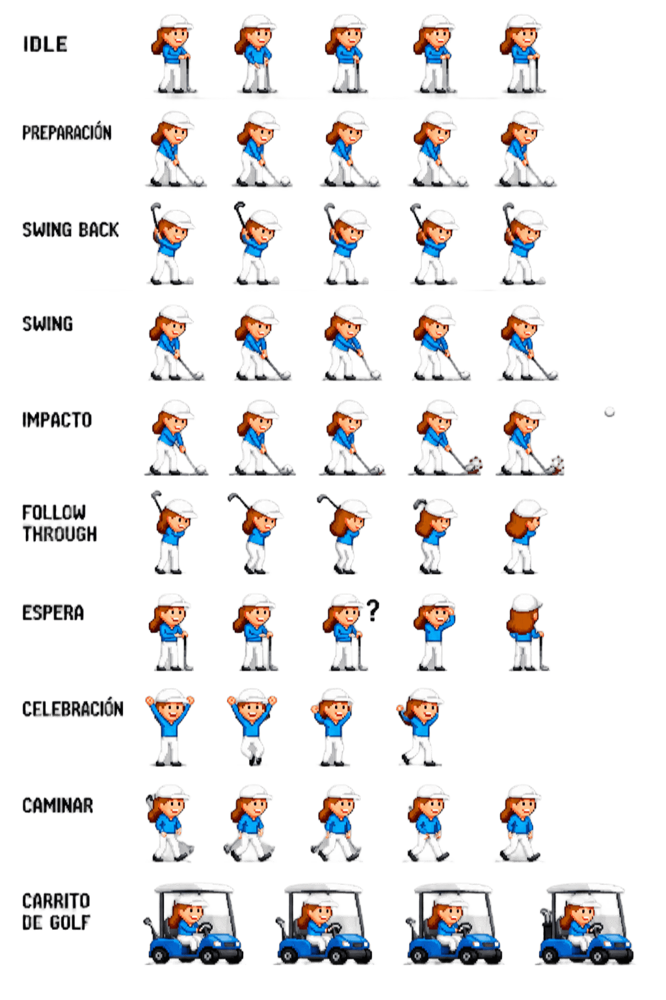
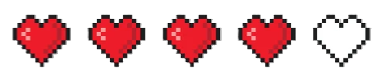
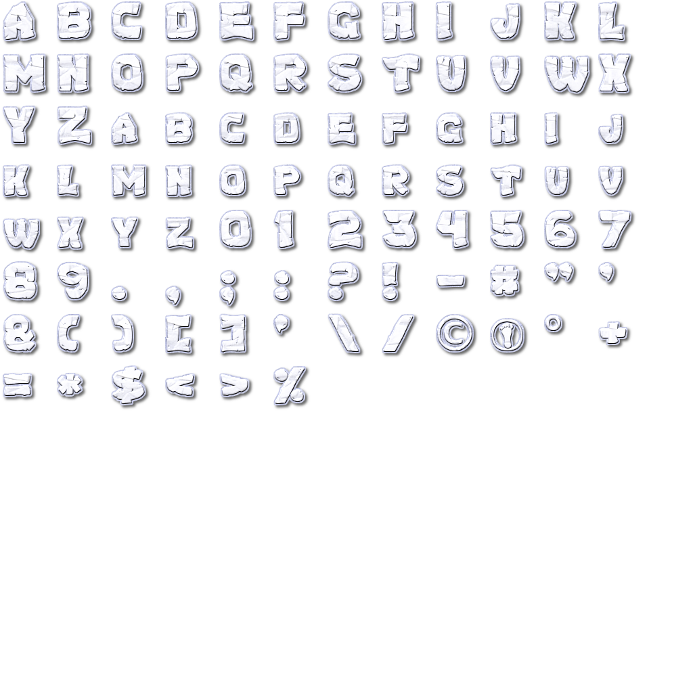

# Momento I: Contextualización del Proyecto

**Proyecto:** Golf en el planeta Cronos - *Crono Golf*

---

## 1. Selección del Evento Deportivo y Universo Central

| Elemento | Selección |
|----------|-----------|
| **Deporte base** | Golf (Mini-golf) |
| **Universo** | Planeta Cronos |
| **Protagonista** | Chronoa Obert |

>[!Note]
> Algunos sprites fueron extraídos de internet y otros han sido creados mediante IA generativa.

---

## 2. Descripción general

El golf tradicional es un deporte que consiste en introducir una pelota en una serie de hoyos utilizando la menor cantidad de golpes posibles. Cada golpe se realiza con un palo de golf y el jugador debe calcular factores como la dirección, la fuerza y el terreno para alcanzar el objetivo de manera eficiente.

Tomando esta idea como base, Golf en el planeta Cronos adapta la experiencia a un formato de mini-golf con mecánicas más simples y dinámicas. El jugador controla la dirección y potencia del disparo mediante un clic sostenido, buscando superar distintos obstáculos y completar cada nivel en la menor cantidad de golpes posible.

Como referencia de la jugabilidad base utilizada para el proyecto, se presenta el siguiente ejemplo:

[JUGABILIDAD CON CLICK SOSTENIDO](https://www.mathplayground.com/pg_mini_golf_2d.html)

---

## Mecánicas y físicas implicadas en Golf

| Mecánica           | Física principal             |
| ------------------ | ---------------------------- |
| Disparo            | Fuerza y dinámica            |
| Movimiento         | Cinemática y fricción        |
| Gravedad           | Gravedad y energía potencial |
| Colisiones         | Elasticidad y rebotes        |
| Superficies        | Fricción e inclinación       |
| Rebotes            | Conservación de energía      |
| Efectos especiales | Rotación y campos físicos    |
| Trayectoria        | Movimiento parabólico        |
| Obstáculos         | Colisiones y fuerzas         |

---

## Mecánica central: Manipulación gravitacional y entorno dinámico

La principal característica de Golf en el planeta Cronos es que la gravedad deja de ser únicamente una fuerza pasiva y se convierte en una herramienta de juego. El jugador no solo debe calcular dirección y potencia, sino también comprender cómo el entorno altera el movimiento de la pelota.

A diferencia del mini-golf tradicional, los escenarios de Cronos están diseñados alrededor de anomalías gravitacionales, estructuras dinámicas y modificaciones físicas que transforman constantemente la trayectoria de la pelota.

### Elementos principales de esta mecánica

| Elemento | Función dentro del juego |
| ---- | ------ |
| **Portales gravitacionales**      | Transportan la pelota entre diferentes zonas del mapa manteniendo o alterando su velocidad y dirección.       |
| **Tubos de flujo**                | Generan corrientes de energía o gravedad que empujan automáticamente la pelota a través de rutas específicas. |
| **Puntos de atracción o impulso** | Alteran la trayectoria al atraer o expulsar la pelota dependiendo de la intensidad gravitacional.             |
| **Obstructores interactivos**     | Obstáculos que modifican el recorrido de forma estratégica y pueden utilizarse para resolver el nivel.        |
| **Superficies especiales**        | Cambian propiedades físicas de la pelota, como rebote, velocidad o resistencia.                               |
| **Obstáculos móviles**            | Elementos dinámicos que obligan al jugador a calcular tiempo, ritmo y precisión.                              |

### Habilidades especiales de la pelota

Durante ciertas secciones del nivel, la pelota puede adquirir propiedades temporales al interactuar con objetos o zonas específicas del escenario.

**Ejemplos:**
- **Indestructibilidad:** Permite atravesar ciertos obstáculos o resistir impactos sin perder velocidad.
Impulso gravitacional: Incrementa temporalmente la aceleración de la pelota.
- **Rebote aumentado:** Genera colisiones más fuertes y trayectorias más impredecibles.
- **Atracción magnética:** Hace que la pelota sea atraída hacia rutas o estructuras específicas.
Estabilidad aérea: Reduce el efecto de la gravedad durante saltos o desplazamientos elevados.

### Enfoque jugable

La experiencia del juego se centra en:

- Experimentación
- Resolución de trayectorias
- Uso estratégico del entorno
- Comprensión de físicas alteradas
- Precisión y sincronización

## Algunos sprites

