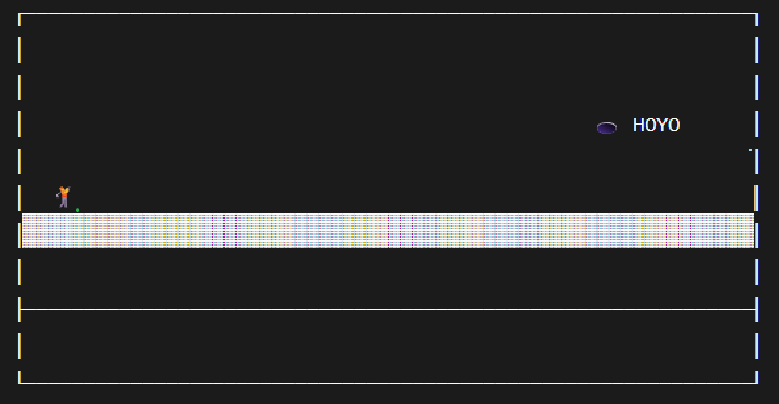
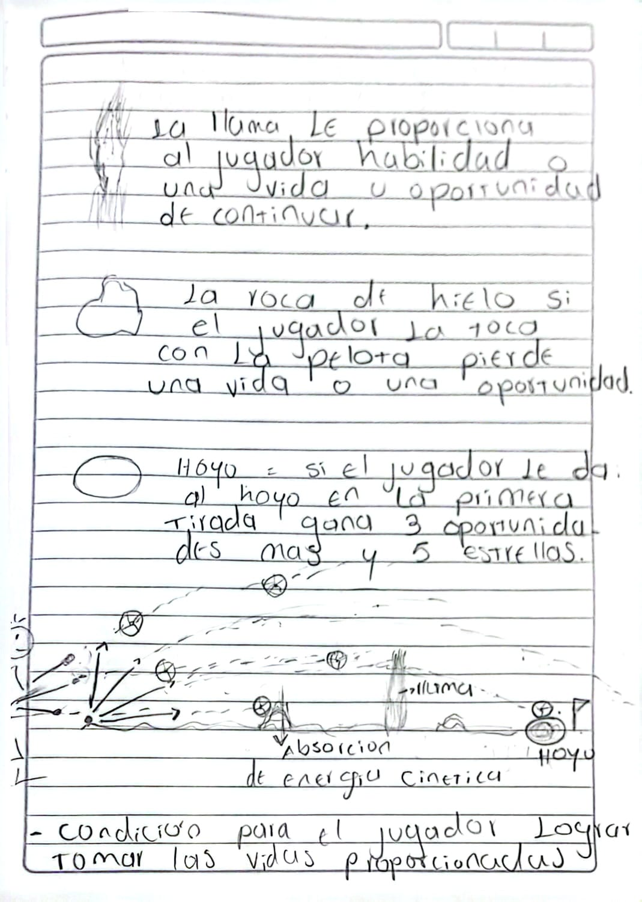
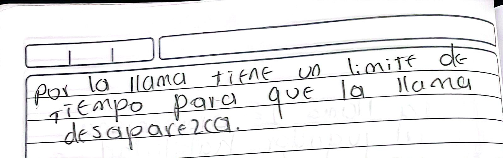

# Momento I: Contextualización del Proyecto

**Proyecto:** Golf en el planeta Cronos

---

## 1. Selección del Evento Deportivo y Universo Central

| Elemento | Selección |
|----------|-----------|
| **Deporte base** | Golf (Mini-golf) |
| **Universo** | Planeta Cronos |
| **Protagonista** | Chronoa Obert |

> **Nota sobre sprites:** Se esta verificando disponibilidad de recursos gráficos para temática espacial/deportiva en plataformas libres (OpenGameArt, Itch.io).

---

## 2. Descripción general

A continuación se presenta una descripción general e informal del juego, incluyendo su concepto visual, algunos principios físicos y la idea principal de su jugabilidad.

> [!NOTE]
> La siguiente imagen busca transmitir el concepto visual base del proyecto.

El juego se desarrolla en el planeta `Cronos`, un mundo donde las leyes físicas no funcionan exactamente igual que en la Tierra. En este entorno, el protagonista, **Chronoa Obert**, practica una versión poco convencional del golf.

A lo largo del juego, el jugador deberá adaptarse a estas condiciones físicas alteradas mientras explora distintos escenarios y supera desafíos utilizando la lógica del mini-golf… pero con giros inesperados.

---

## Principios físicos del mundo

En Cronos, varias reglas físicas cambian o se comportan de forma distinta. Algunos de los aspectos más relevantes son:

1. **Gravedad variable:** Existen zonas donde la gravedad cambia de dirección o intensidad, atrayendo la pelota hacia puntos específicos.
2. **Rebotes alterados:** Las superficies pueden modificar el comportamiento del rebote, haciéndolo más impredecible o exagerado.
3. **Fricción especial:** Dependiendo del material, la pelota puede deslizarse más de lo normal o detenerse bruscamente.
4. **Materiales fantásticos:** Algunos elementos del entorno tienen propiedades únicas (absorción de energía, impulso, ralentización, etc.).

---

## Detalles del juego

**Golf en el planeta Cronos** consiste en utilizar el entorno para lograr que la pelota llegue al hoyo, superando obstáculos y aprovechando las mecánicas del escenario.

El juego presenta una progresión horizontal: el mapa se va desbloqueando a medida que el jugador avanza, creando una sensación de recorrido continuo.

Además, el juego incluye:

* **Potenciadores**, como llamas que otorgan habilidades o segundas oportunidades.
* **Obstáculos**, como rocas de hielo que penalizan al jugador.
* **Sistema de vidas**, ligado a intentos o errores.
* **Sistema de puntuación por estrellas**, basado en:

  * Tiempo.
  * Número de intentos.
  * Precisión del tiro.

> La combinación de estos elementos busca que cada nivel sea tanto un reto estratégico como una experiencia dinámica.

---
