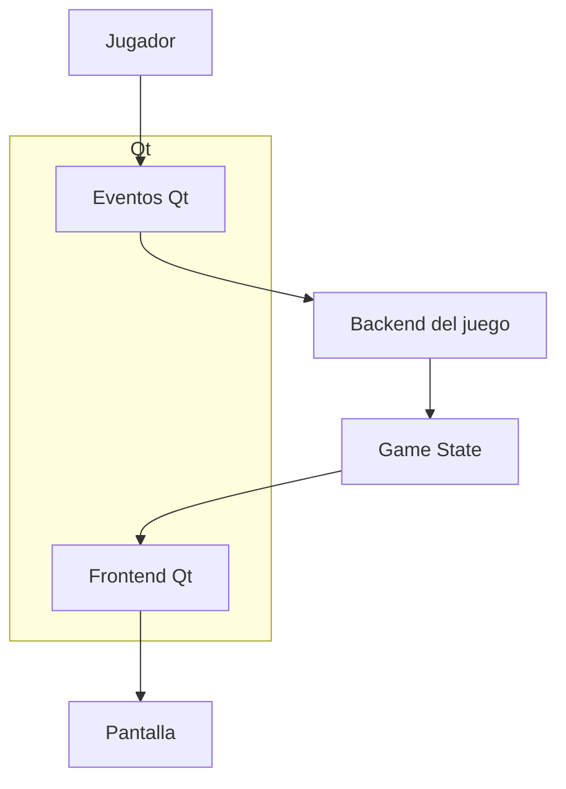
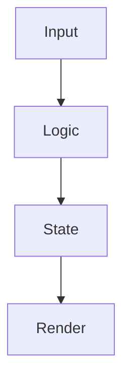
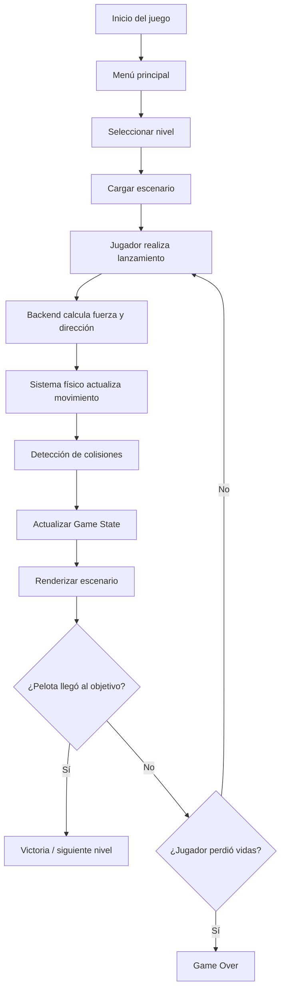
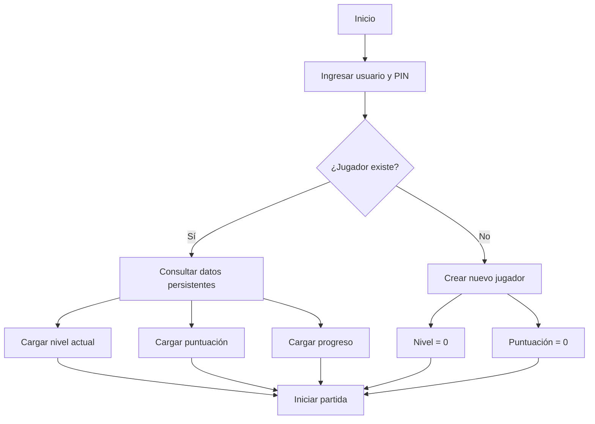
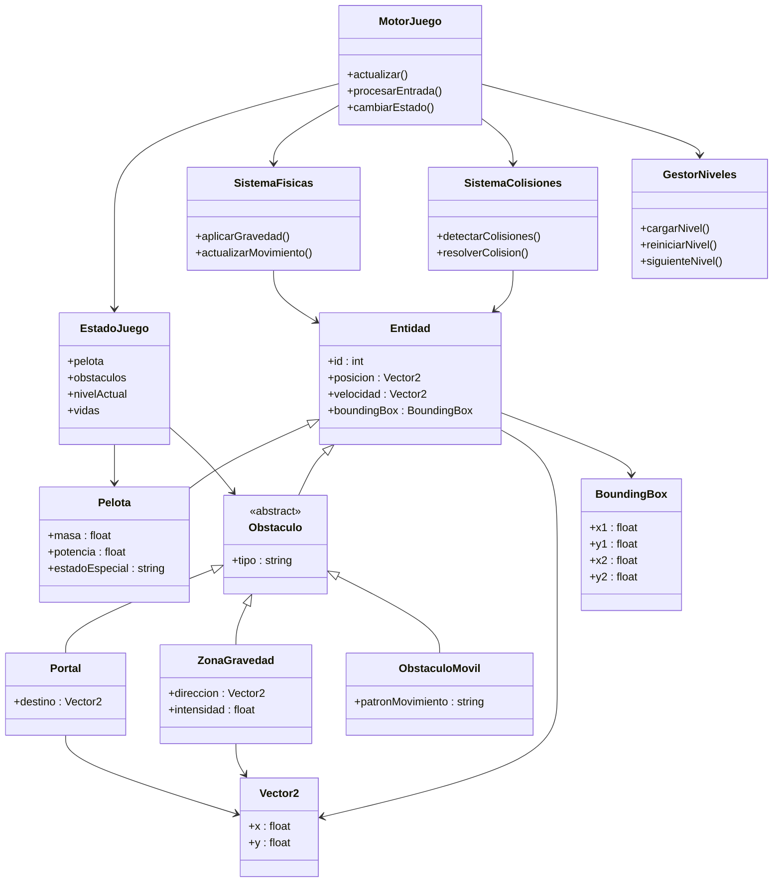
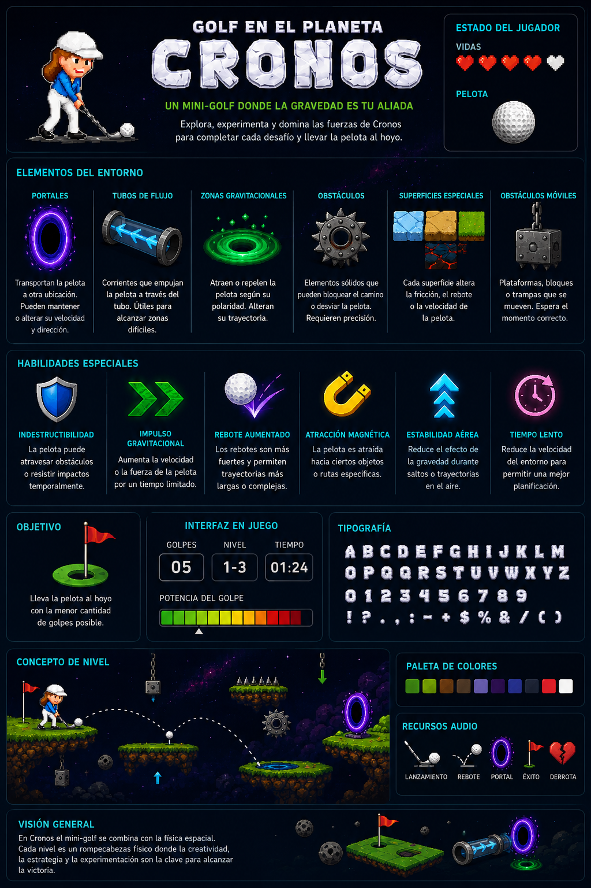

# Momento 2: Especificaciones del juego y recursos audio visuales

## Contexto

Antes de iniciar la descripción de las partes internas del sistema y sus funciones, es necesario consolidar el contexto planteado en el momento 1. En el commit de referencia en main [ff00c22](https://github.com/Elmer-Mosquera-UdeA/proyecto-final-2026-1/commit/ff00c222a463743d2e58d323d27098ffbf5aff29) todavía existía información insuficiente para identificar correctamente las entidades y relaciones principales del proyecto.

Debido a esto, se realizó una [**versión actualizada del momento 1**](../momento-1/momento-uno-update.md), donde se profundiza en:

- la jugabilidad,
- las físicas,
- la identidad visual,
- y la arquitectura conceptual del juego.

---

# Idea base de la arquitectura

Es necesario comprender la arquitectura base del juego antes de identificar las entidades y clases del sistema. La estructura propuesta separa la lógica interna del juego de la representación visual, permitiendo que cada componente tenga una responsabilidad específica dentro del proyecto.

La arquitectura se basa en un modelo orientado a estados, donde el backend se encarga de actualizar continuamente la lógica, físicas y reglas del juego, mientras que el frontend únicamente interpreta el estado actual y lo representa visualmente mediante la interfaz gráfica construida en Qt.

De esta manera, el sistema mantiene desacopladas las mecánicas del renderizado, facilitando la escalabilidad, el mantenimiento y la incorporación de nuevas funcionalidades como niveles, físicas especiales y comportamientos dinámicos.



> [!IMPORTANT]
> **En resumen:** Las acciones del jugador son capturadas por Qt y procesadas por el backend del juego. Posteriormente, las físicas y reglas actualizan el estado global (`Game State`), el cual es interpretado por el frontend para representar visualmente los cambios en pantalla.



---

# Lógica de jugabilidad

La jugabilidad del proyecto se basa en un sistema de simulación continua orientado a estados. Cuando el jugador realiza un lanzamiento, Qt captura el evento del mouse y envía esta información al backend, el cual calcula dirección, potencia y fuerza aplicada sobre la pelota.

A partir de este momento, comienza un ciclo constante de actualización donde las físicas modifican continuamente el movimiento de la pelota, aplicando gravedad, aceleración, fricción y rebotes.

El sistema de colisiones analiza únicamente las regiones cercanas a la pelota mediante áreas rectangulares de interacción (`Bounding Boxes`), evitando recorrer el escenario completo en cada actualización. Esto permite optimizar el procesamiento físico y mantener una simulación fluida incluso en niveles dinámicos.

Durante el recorrido, la trayectoria puede alterarse por:

- obstáculos,
- zonas gravitacionales,
- portales,
- superficies especiales,
- y estructuras móviles.

El juego finaliza cuando:

- el jugador alcanza el hoyo objetivo,
- pierde todas las vidas,
- o decide abandonar la partida.

---

## Flujo general de jugabilidad



---

# Identificación de entidades

El juego se compone de un conjunto de entidades encargadas de representar los distintos elementos interactivos presentes en los niveles. Estas entidades permiten organizar la lógica física, las interacciones y el estado general de la partida.

La entidad principal es la pelota, la cual interactúa constantemente con obstáculos, zonas gravitacionales, portales y superficies especiales. Además, el sistema contempla persistencia básica de progreso mediante almacenamiento del estado del jugador.

Cuando un usuario inicia sesión utilizando un identificador y un PIN, el sistema consulta la información persistente asociada al jugador y restablece el progreso almacenado previamente.

Cada jugador posee información asociada como:

- nivel actual,
- puntuación,
- vidas,
- progreso general.

En caso de tratarse de un nuevo jugador, el sistema inicializa valores por defecto:

- nivel actual = 0,
- puntuación = 0.

De esta manera, el juego puede continuar desde el último punto alcanzado sin reiniciar completamente la experiencia.

---

## Flujo de persistencia y carga



---

# Diagrama de clases

La estructura del backend se organiza alrededor de un motor principal encargado de coordinar la simulación física, el manejo del estado global y las interacciones entre entidades.

El `MotorJuego` controla el flujo principal de actualización y delega responsabilidades a sistemas especializados como físicas, colisiones y administración de niveles. Toda la información dinámica del juego se almacena en `EstadoJuego`, el cual funciona como representación central del estado actual de la partida.

Las entidades comparten una estructura base común que permite reutilizar propiedades espaciales y físicas dentro del sistema.



---

# Recursos audio visuales

## Concepto visual general

La siguiente imagen presenta una visión general de los elementos principales del juego, incluyendo:

- protagonista,
- HUD,
- obstáculos,
- mecánicas gravitacionales,
- y componentes visuales preliminares utilizados durante el desarrollo.



---

## Recursos gráficos preliminares

| Recurso                   | Descripción                     |
| ------------------------- | ------------------------------- |
| `Chronoa Obert`           | Personaje principal             |
| `HUD de vidas`            | Indicador visual de vidas       |
| `Bandera objetivo`        | Objetivo principal del nivel    |
| `Sprites gravitacionales` | Elementos de interacción física |
| `Obstáculos dinámicos`    | Entidades móviles del escenario |

---

## Recursos de audio propuestos

| Tipo                      | Uso                    |
| ------------------------- | ---------------------- |
| Música ambiental espacial | Ambientación principal |
| Sonido de lanzamiento     | Interacción principal  |
| Rebotes y colisiones      | Feedback físico        |
| Activación de portales    | Eventos especiales     |
| Victoria / derrota        | Estados del juego      |

---

<!-- ## Vista previa de audio en HTML

```html
<audio controls>
  <source src="../recursos/audio/lanzamiento.mp3" type="audio/mpeg">
</audio>
``` -->
